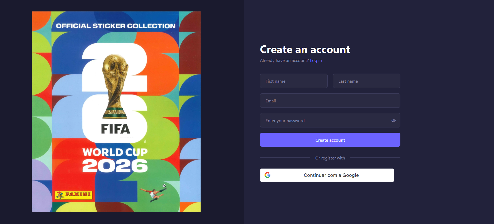
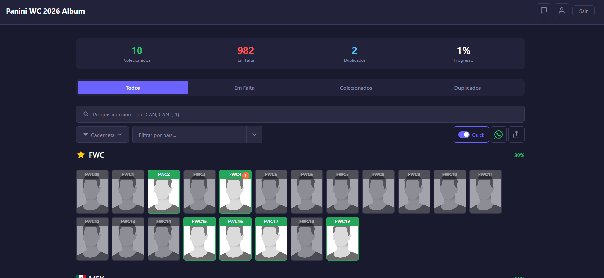
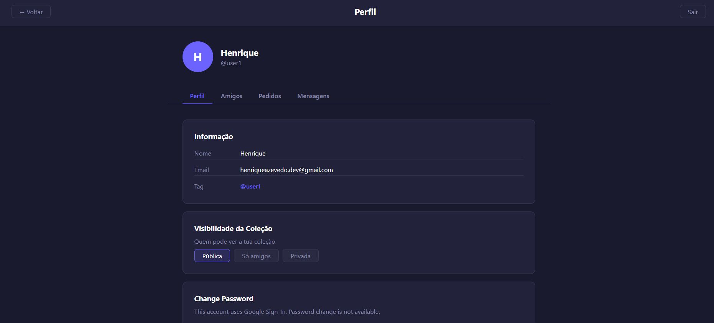
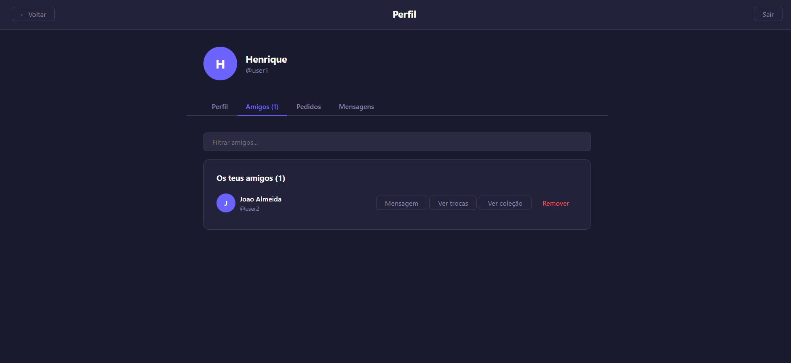
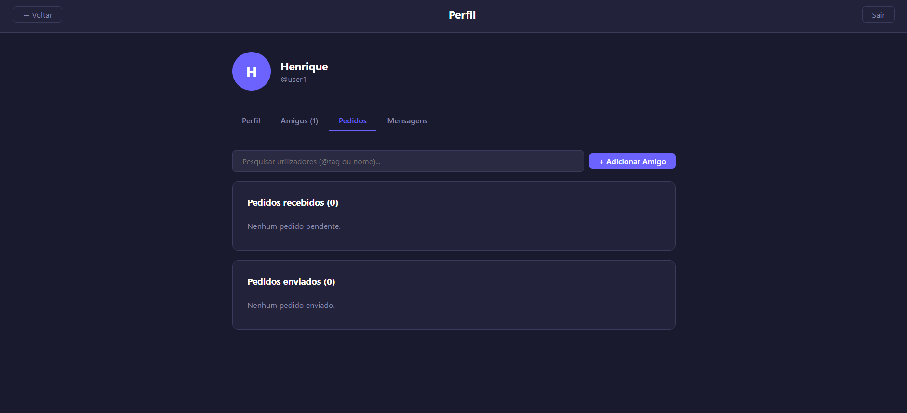
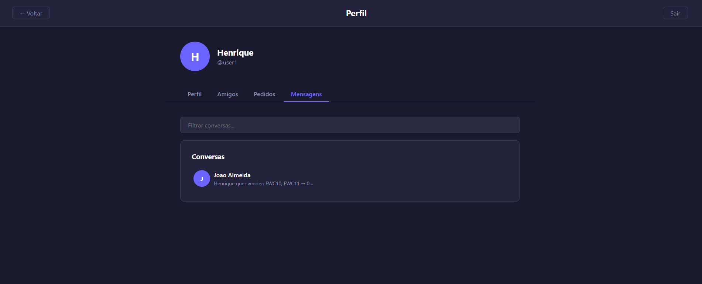
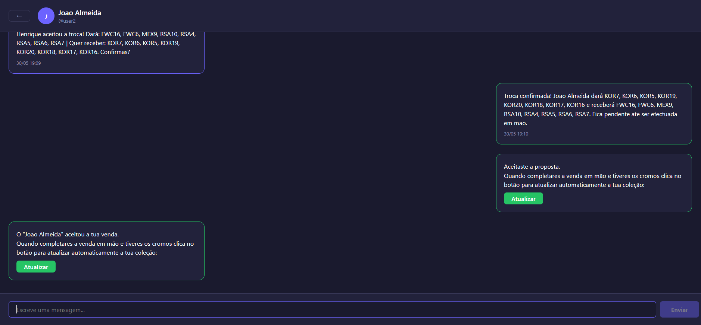

<div align="center">

# Sticker Marker

**Track your sticker collection. Trade, buy and sell with friends.**

[](https://henrique-s-azevedo.github.io/sticker-marker/)
[](https://sticker-marker-production.up.railway.app/actuator/health)
[](https://openjdk.org/projects/jdk/17/)
[](https://spring.io/projects/spring-boot)
[](https://react.dev/)
[](https://neon.tech/)

</div>

---

## Overview

Sticker Marker is a full-stack web application for managing Panini sticker album collections, currently configured for the **FIFA World Cup 2026** album.

Users can mark stickers as owned, missing, or duplicate, and track their overall collection progress per section. The social layer allows users to connect with friends, view each other's public collections, and coordinate sticker exchanges — all through an integrated trade, buy/sell, and chat system.

---

## Screenshots

<p align="center">
  
  
</p>

<p align="center">
  
</p>

<p align="center">
  
  
</p>

<p align="center">
  
  
</p>

<p align="center">
  
</p>

---

## Features

### Collection Management

Users can browse a visual sticker grid where each card shows one of three states: Owned, Missing, or Duplicate. A quick mode allows single-tap marking for bulk entry sessions. Stickers can be filtered by country, searched by code or player name, and sorted by various criteria. Progress is tracked per section with a completion percentage, and the full collection can be exported by section.

### Social and Friends

Users can find and add friends by email address or @userTag. Invite links with QR codes and configurable expiry are available for onboarding new users. Collection visibility is configurable per user — Private, Friends Only, or Public — and friends can browse each other's public collections directly.

### Trade System

Sticker Marker automatically calculates which stickers two friends can exchange with each other based on their respective owned and duplicate collections. Trades follow a multi-step lifecycle — propose, accept, confirm, complete — and on completion both users' collections are updated automatically in the database.

### Buy and Sell System

The sell flow calculates which duplicates a user can sell to a specific friend. Stickers can be grouped into pricing batches, and the full proposal is sent and negotiated through the chat interface. Accepting a sell proposal updates both collections in a single operation.

### Integrated Chat

Every friendship has a dedicated conversation thread. Trade and sell proposals are embedded directly in the chat as interactive messages, keeping all negotiation in context. Unread message counts are shown in the header.

### Authentication

Users can register and log in with email and password, or use Google Sign-In. Sessions use a short-lived JWT access token (15 minutes) paired with a long-lived refresh token (7 days) stored in the database. Email verification is required for sensitive operations such as password changes, delivered via Brevo.

---

## Tech Stack

### Backend

| Technology | Version | Role |
|---|---|---|
| Java | 17 | Runtime |
| Spring Boot | 4.0.6 | Framework |
| Spring Security | — | Authentication and CORS |
| Spring Data JPA | — | ORM and repositories |
| JJWT | 0.12.6 | JWT generation and validation |
| PostgreSQL | — | Relational database |
| Lombok | — | Boilerplate reduction |
| Brevo API | HTTP | Transactional email |
| Google OAuth2 | HTTP | ID token verification |

### Frontend

| Technology | Version | Role |
|---|---|---|
| React | 19 | UI framework |
| React Router DOM | 7 | Client-side routing |
| Vite | 8 | Build tool and dev server |
| qrcode.react | 4 | QR code generation |

### Infrastructure

| Service | Role |
|---|---|
| Railway | Backend hosting via Docker |
| Neon | Serverless PostgreSQL (eu-west-2) |
| GitHub Pages | Frontend hosting |
| GitHub Actions | Frontend CI/CD pipeline |
| Brevo | Transactional email delivery |

---

## Project Structure

```
sticker-marker/
├── backend/
│   ├── Dockerfile
│   ├── pom.xml
│   └── src/main/java/com/henrique/stickermarker/
│       ├── config/          # SecurityConfig, DatabaseMigrationConfig
│       ├── controller/      # REST endpoints (14 controllers)
│       ├── dto/             # Request and response contracts
│       ├── model/           # JPA entities and enums
│       ├── repository/      # Spring Data JPA interfaces
│       ├── security/        # JwtAuthFilter, JwtUtil, UserDetailsService
│       └── service/         # Business logic (16 services)
│
├── frontend/
│   ├── vite.config.js
│   ├── package.json
│   └── src/
│       ├── App.jsx               # Router and route definitions
│       ├── context/
│       │   └── AuthContext.jsx   # Global auth state and token management
│       ├── pages/                # One component per route (10 pages)
│       ├── components/           # Reusable UI (auth, collection, common, trade)
│       └── services/             # HTTP clients per domain (7 services)
│
├── screenshots/
├── TECHNICAL_DOCUMENTATION.md
└── README.md
```

---

## Getting Started

### Prerequisites

- Java 17+ and Maven 3.9+
- Node.js 20+
- A PostgreSQL database (or use the hosted Neon instance)

### Option A — Frontend only, against the production backend

The fastest way to run the project locally without setting up a backend:

```bash
# Point the frontend at the production Railway API
echo "VITE_API_URL=https://sticker-marker-production.up.railway.app" > frontend/.env.local

cd frontend
npm install
npm run dev
# Runs at http://localhost:5173
```

### Option B — Full stack locally

**Backend:**

```bash
export DATASOURCE_URL=jdbc:postgresql://<host>/<db>
export DATASOURCE_USERNAME=<user>
export DATASOURCE_PASSWORD=<password>
export JWT_SECRET=<256-bit-secret>
export CORS_ALLOWED_ORIGINS=http://localhost:5173
export FRONTEND_URL=http://localhost:5173
export GOOGLE_CLIENT_ID=<your-google-client-id>
export BREVO_API_KEY=<your-brevo-key>

cd backend
mvn package -DskipTests
mvn spring-boot:run
# Runs at http://localhost:8080
# Health check: http://localhost:8080/actuator/health
```

**Frontend:**

```bash
# Empty VITE_API_URL causes the Vite dev proxy to route /api/* to localhost:8080
echo "VITE_API_URL=" > frontend/.env.local

cd frontend
npm install
npm run dev
# Runs at http://localhost:5173
```

### Environment Variables Reference

| Variable | Where | Required | Description |
|---|---|---|---|
| `DATASOURCE_URL` | Backend | Yes | PostgreSQL JDBC connection URL |
| `DATASOURCE_USERNAME` | Backend | Yes | Database username |
| `DATASOURCE_PASSWORD` | Backend | Yes | Database password |
| `JWT_SECRET` | Backend | Yes | HMAC-SHA256 secret (256 bits minimum) |
| `CORS_ALLOWED_ORIGINS` | Backend | Yes | Frontend origin without trailing slash |
| `FRONTEND_URL` | Backend | Yes | Frontend base URL |
| `GOOGLE_CLIENT_ID` | Backend + Frontend | Yes | Google OAuth2 Client ID |
| `BREVO_API_KEY` | Backend | For emails | Brevo transactional email API key |
| `VITE_API_URL` | Frontend | Production | Backend base URL |

---

## Build and Deploy

### Backend — Railway

Any push to `master` triggers an automatic redeploy on Railway via the `Dockerfile`. The health check endpoint is `GET /actuator/health`.

```bash
git push origin master
```

### Frontend — GitHub Pages

The GitHub Actions workflow (`.github/workflows/deploy-frontend.yml`) triggers on any push to `master` that touches `frontend/**`. It builds the app using the `VITE_API_URL` repository variable and deploys to GitHub Pages.

```bash
git push origin master
# Deploys to: https://henrique-s-azevedo.github.io/sticker-marker/
```

To build the frontend manually:

```bash
cd frontend
npm run build
# Output: frontend/dist/
```

---

## Roadmap / Future Features

| Priority | Feature |
|---|---|
| High | Automated integration tests (Testcontainers + Spring Boot Test) |
| Medium | Real-time chat via WebSockets (STOMP) |
| Medium | Push notifications for new messages and trade proposals |
| Medium | Multi-album support (any Panini collection, not just WC 2026) |
| Low | TypeScript migration for the frontend |
| Low | Rate limiting on `/auth/**` endpoints |
| Low | Profile picture upload |

---

<div align="center">
  Built by <a href="https://github.com/henrique-s-azevedo">Henrique Azevedo</a>
</div>
