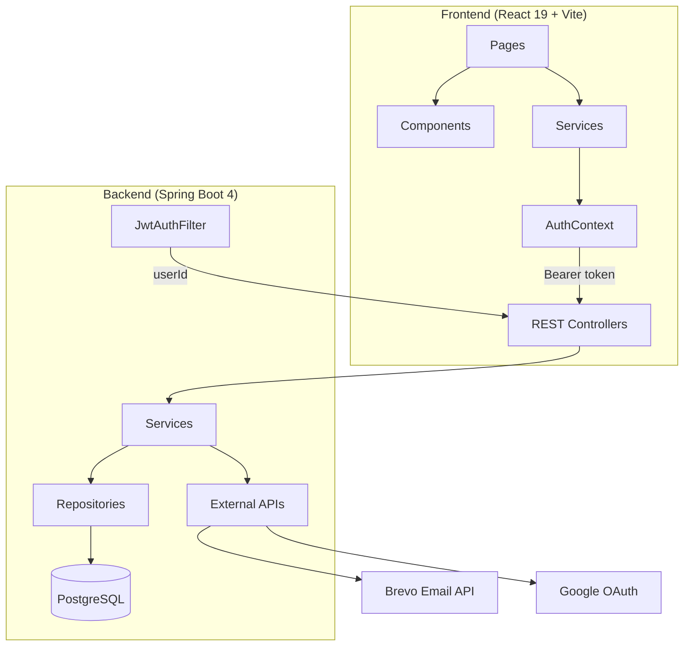
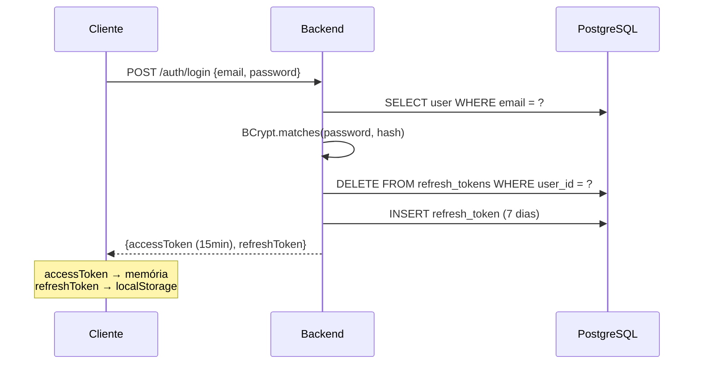
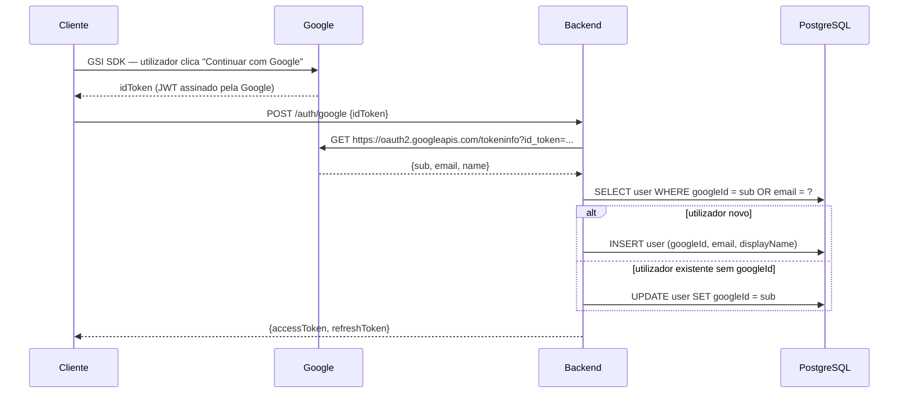

# Sticker Marker — Documentação Técnica

> **Versão:** 1.0.0 · **Stack:** Spring Boot 4 / React 19 / PostgreSQL · **Última revisão:** 2026-06-12

---

## Índice

1. [Visão Geral do Sistema](#1-visão-geral-do-sistema)
2. [Objetivos e Problemas Resolvidos](#2-objetivos-e-problemas-resolvidos)
3. [Arquitetura Geral](#3-arquitetura-geral)
4. [Componentes Detalhados](#4-componentes-detalhados)
   - 4.1 [Backend — Spring Boot](#41-backend--spring-boot)
   - 4.2 [Frontend — React/Vite](#42-frontend--reactvite)
   - 4.3 [Base de Dados — PostgreSQL](#43-base-de-dados--postgresql)
5. [Fluxos Principais](#5-fluxos-principais)
6. [API Reference](#6-api-reference)
7. [Dependências e Tecnologias](#7-dependências-e-tecnologias)
8. [Padrões Aplicados](#8-padrões-aplicados)
9. [Decisões Técnicas](#9-decisões-técnicas)
10. [Executar o Projeto](#10-executar-o-projeto)
11. [Testes](#11-testes)
12. [Problemas Identificados e Melhorias Futuras](#12-problemas-identificados-e-melhorias-futuras)

---

## 1. Visão Geral do Sistema

O **Sticker Marker** é uma aplicação web full-stack para gestão de coleções de cromos (sticker albums). Permite que utilizadores registem os seus cromos (possuídos, em falta, repetidos), vejam o progresso da coleção, partilhem coleções com amigos e efetuem trocas ou compras/vendas de cromos repetidos entre utilizadores.

O sistema está atualmente configurado para a coleção **FIFA World Cup 2026 Panini**.

### Topologia de Produção

```
┌────────────────────────────────────────────────────────┐
│                    CLIENTE (browser)                   │
│         GitHub Pages — henrique-s-azevedo.github.io    │
│                  /sticker-marker/                      │
└────────────────────┬───────────────────────────────────┘
                     │ HTTPS / REST JSON
                     ▼
┌────────────────────────────────────────────────────────┐
│                 BACKEND (Railway)                      │
│    sticker-marker-production.up.railway.app            │
│    Spring Boot 4 · Java 17 · porta 8080                │
└────────────────────┬───────────────────────────────────┘
                     │ JDBC / pgwire
                     ▼
┌────────────────────────────────────────────────────────┐
│              BASE DE DADOS (Neon)                      │
│    PostgreSQL · eu-west-2.aws.neon.tech                │
└────────────────────────────────────────────────────────┘
```

---

## 2. Objetivos e Problemas Resolvidos

| Problema | Solução implementada |
|---|---|
| Controlo manual e disperso de cromos possuídos/em falta | Grelha visual com estados OWNED / MISSING / DUPLICATE por cromo |
| Dificuldade em calcular trocas possíveis com amigos | Motor de cálculo automático de trocas (duplicados de A ↔ em falta de B) |
| Sem plataforma para compra/venda informal de cromos | Sistema de propostas SELL/BUY com multi-batch e preço por lote |
| Partilha de estado de coleção com terceiros | Visibilidade configurável (PRIVATE / FRIENDS\_ONLY / PUBLIC) + URL pública |
| Friç​ão no processo de adicionar amigos | Códigos de convite com QR Code + pesquisa por e-mail ou userTag |
| Comunicação dispersa (WhatsApp, etc.) | Chat direto entre amigos integrado na plataforma |

---

## 3. Arquitetura Geral

### 3.1 Diagrama de Camadas



### 3.2 Camadas do Backend

```
com.henrique.stickermarker/
├── config/          ← SecurityConfig, DatabaseMigrationConfig
├── controller/      ← Entrada HTTP, extrai userId do SecurityContext
├── dto/             ← Contratos de API (request/response)
├── model/           ← Entidades JPA
├── repository/      ← Interfaces Spring Data JPA
├── security/        ← JWT filter, JwtUtil, UserDetailsService
└── service/         ← Lógica de negócio
```

### 3.3 Camadas do Frontend

```
src/
├── pages/           ← Uma página por rota
├── components/      ← Componentes reutilizáveis (auth, collection, common, trade)
├── context/         ← AuthContext (estado global de autenticação)
├── services/        ← Clientes HTTP para cada domínio da API
└── assets/          ← Imagens estáticas
```

---

## 4. Componentes Detalhados

### 4.1 Backend — Spring Boot

#### Modelos (Entidades JPA)

| Entidade | Campos principais | Relações |
|---|---|---|
| `User` | id, email (unique), passwordHash, displayName, userTag (unique), googleId, collectionVisibility | 1:N UserSticker, 1:N UserDuplicate |
| `Collection` | id, name (unique), totalStickers, totalPages | 1:N Sticker |
| `Sticker` | id, number, code (unique), teamName, teamInitial, playerName, pageNumber | N:1 Collection |
| `UserSticker` | id, hasSticker | N:1 User, N:1 Sticker |
| `UserDuplicate` | id, quantity | N:1 User, N:1 Sticker · unique(user, sticker) |
| `Friendship` | id, status, createdAt | N:1 User (requester, addressee) |
| `Message` | id, content (max 1000), sentAt, readAt, messageType | N:1 User (sender, recipient) |
| `TradeProposal` | id, proposerItems (List\<String\>), counterpartItems, collectionId, status | N:1 User (proposer, counterpart) |
| `SellProposal` | id, status, createdAt | N:1 User (seller, buyer) · 1:N SellProposalItem |
| `SellProposalItem` | id, stickerCode, quantity, price, batchIndex | N:1 SellProposal |
| `RefreshToken` | id, token (unique, 500), expiryDate | N:1 User |
| `InviteCode` | id, code (unique), expiresAt, active | N:1 User |
| `EmailVerificationCode` | id, userId, code, expiresAt, used | — |

#### Enumerações

| Enum | Valores |
|---|---|
| `CollectionVisibility` | `PRIVATE`, `FRIENDS_ONLY`, `PUBLIC` |
| `FriendshipStatus` | `PENDING`, `ACCEPTED`, `REJECTED` |
| `TradeStatus` | `PENDING_COUNTERPART`, `ACCEPTED_COUNTERPART`, `CONFIRMED_BY_PROPOSER`, `COMPLETED`, `REJECTED` |
| `SellProposalStatus` | `PENDING`, `COMPLETED`, `CANCELLED` |
| `MessageType` | `CHAT`, `TRADE_PROPOSAL`, `TRADE_RESPONSE`, `TRADE_CONFIRMED`, `TRADE_REJECTED`, `SELL_PROPOSAL`, `BUY_PROPOSAL` |

#### Segurança

**JWT (JJWT 0.12.6)**

| Parâmetro | Valor |
|---|---|
| Algoritmo | HMAC-SHA256 |
| Access token TTL | 15 minutos (900 000 ms) |
| Refresh token TTL | 7 dias |
| Secret | env var `JWT_SECRET` |
| Claims | `sub` = email, `userId` = Long |

**Filter Chain (`SecurityConfig`)**

```
Request
  └── JwtAuthenticationFilter (OncePerRequestFilter)
        ├── Extrai "Bearer {token}" do header Authorization
        ├── Valida assinatura e expiração
        ├── Extrai userId + email
        ├── Carrega UserDetails (CustomUserDetailsService)
        └── Coloca UsernamePasswordAuthenticationToken no SecurityContext
              └── Controller extrai userId via authentication.getDetails()
```

**Rotas públicas** (sem autenticação): `/auth/**`, `/actuator/**`, `/error`

**CORS** — origin permitida: `https://henrique-s-azevedo.github.io`; métodos: GET, POST, PUT, DELETE, OPTIONS, PATCH.

#### Serviços

| Serviço | Responsabilidade principal |
|---|---|
| `AuthService` | Registo, login (email+pass), Google OAuth, refresh |
| `UserService` | CRUD de utilizador, geração de userTag, visibilidade |
| `CollectionService` | Coleções, progresso, stickers com estado, export |
| `StickerService` | CRUD de cromos globais |
| `UserStickerService` | Inventário pessoal de cromos possuídos |
| `UserDuplicateService` | Gestão de repetidos com quantidade |
| `FriendshipService` | Pedidos, aceitação, remoção, pesquisa |
| `MessageService` | Envio, leitura, contagem de não lidos |
| `TradeService` | Cálculo, proposta, confirmação e conclusão de trocas |
| `SellService` | Cálculo, proposta, conclusão e cancelamento de vendas |
| `RefreshTokenService` | Ciclo de vida dos refresh tokens |
| `InviteCodeService` | Geração e aceitação de convites |
| `EmailService` | Envio de e-mails via Brevo HTTP API |
| `ExportService` | Geração de exportação de coleção |
| `GoogleTokenVerifier` | Validação de ID tokens do Google |

---

### 4.2 Frontend — React/Vite

#### Roteamento (`App.jsx`)

| Rota | Componente | Acesso |
|---|---|---|
| `/login` | `LoginPage` | Público |
| `/register` | `RegisterPage` | Público |
| `/collection` | `CollectionPage` | Autenticado |
| `/profile` | `ProfilePage` | Autenticado |
| `/collection/:userTag` | `PublicCollectionPage` | Autenticado |
| `/invite/:code` | `InvitePage` | Autenticado |
| `/chat/:friendId` | `ChatPage` | Autenticado |
| `/trade/:friendId` | `TradePage` | Autenticado |
| `/trade-respond/:tradeId` | `TradeRespondPage` | Autenticado |
| `/sell/:friendId` | `SellPage` | Autenticado |
| `*` | Redirect `/collection` | — |

Base path de build: `/sticker-marker/` (GitHub Pages).

#### Gestão de Estado — `AuthContext`

```js
// Tokens
memoryAccessToken     ← access token em memória (não persiste, protege contra XSS)
localStorage          ← refresh token com chave 'sm_refresh_token'

// Ao montar: tenta rehydrate automático via refresh token guardado
// Ao fazer logout: limpa memória + localStorage
```

**Fluxo de token:**

```
App mount
  └── AuthContext.useEffect
        └── refreshToken em localStorage?
              ├── Sim → POST /auth/refresh → novo accessToken em memória
              └── Não → utilizador fica não-autenticado
```

#### Serviços HTTP

Todos os serviços usam `import.meta.env.VITE_API_URL ?? '/api'` como base.

Em **desenvolvimento**, o Vite proxy em `vite.config.js` mapeia `/api/*` → `http://localhost:8080/*` (sem prefixo).

Em **produção**, `VITE_API_URL` aponta diretamente para Railway.

#### Sistema de Design (CSS Variables)

```css
/* Paleta principal */
--color-bg:        #1a1a2e   /* fundo geral */
--color-surface:   #22223b   /* painéis/cards */
--color-primary:   #6c63ff   /* ações principais */

/* Estados de cromo */
--color-owned:     #26a65b   /* verde — possui */
--color-missing:   #444460   /* cinzento — em falta */
--color-duplicate: #ff6b35   /* laranja — repetido */

/* Tipografia */
font-family: Inter, Segoe UI, system-ui
```

---

### 4.3 Base de Dados — PostgreSQL

**Host:** Neon (serverless PostgreSQL, eu-west-2)  
**Migração:** `spring.jpa.hibernate.ddl-auto=update` — Hibernate aplica alterações de schema automaticamente.

#### Diagrama ER Simplificado

```
users ──────────────────────────────────────────────┐
  │                                                  │
  ├─1:N─ user_stickers ───N:1─ stickers ─N:1─ collections
  ├─1:N─ user_duplicates ─N:1─ stickers
  ├─1:N─ friendships (requester / addressee → users)
  ├─1:N─ messages (sender / recipient → users)
  ├─1:N─ trade_proposals (proposer / counterpart → users)
  │         └─ trade_proposer_items  (ElementCollection)
  │         └─ trade_counterpart_items (ElementCollection)
  ├─1:N─ sell_proposals (seller / buyer → users)
  │         └─ sell_proposal_items
  ├─1:N─ refresh_tokens
  ├─1:N─ invite_codes
  └─1:N─ email_verification_codes
```

**Constraint manual relevante:**

```sql
-- Aplicada via DatabaseMigrationConfig no arranque
ALTER TABLE messages
  DROP CONSTRAINT IF EXISTS messages_message_type_check;
ALTER TABLE messages
  ADD CONSTRAINT messages_message_type_check
  CHECK (message_type IN (
    'CHAT','TRADE_PROPOSAL','TRADE_RESPONSE',
    'TRADE_CONFIRMED','TRADE_REJECTED',
    'SELL_PROPOSAL','BUY_PROPOSAL'
  ));
```

Esta constraint foi re-criada manualmente porque o Hibernate `ddl-auto=update` não altera constraints `CHECK` existentes.

---

## 5. Fluxos Principais

### 5.1 Autenticação — Login com E-mail



### 5.2 Autenticação — Google OAuth



### 5.3 Request Autenticado

```
Cliente → Authorization: Bearer {accessToken}
  └── JwtAuthenticationFilter
        ├── Extrai e valida token
        ├── Carrega UserDetails (email)
        └── Armazena userId em authentication.details
              └── Controller: Long userId = (Long) authentication.getDetails()
```

### 5.4 Fluxo de Troca (Trade)

```
Amigo A                          Backend                        Amigo B
   │                                │                               │
   ├─GET /me/trades/calculate/{B}──►│ Calcula duplicados A ↔        │
   │◄── TradeCaculationDTO ─────────┤ em falta de B                 │
   │                                │                               │
   ├─POST /me/trades/propose/{B} ──►│ Cria TradeProposal            │
   │                                │  status=PENDING_COUNTERPART   │
   │                                ├── Envia mensagem TRADE_PROPOSAL► B
   │                                │                               │
   │                                │◄─POST /me/trades/{id}/respond─┤
   │                                │ status=ACCEPTED_COUNTERPART   │
   │                                ├── Envia mensagem TRADE_RESPONSE►A
   │                                │                               │
   ├─POST /me/trades/{id}/confirm ─►│ status=CONFIRMED_BY_PROPOSER  │
   │                                │                               │
   ├─POST /me/trades/{id}/complete ►│ Executa troca:                │
   │                                │  • Remove duplicados de A     │
   │                                │  • Marca cromos de B como owned│
   │                                │  • (simétrico para B)         │
```

### 5.5 Fluxo de Venda

```
Vendedor                         Backend                        Comprador
   │                                │                               │
   ├─GET /me/sell/calculate-sell/{B}►│ Duplicados do vendedor vs     │
   │◄── SellCalculationDTO ─────────┤ coleção do comprador          │
   │                                │                               │
   ├─POST /me/sell/propose-sell/{B}►│ Cria SellProposal + Items     │
   │                                │  status=PENDING               │
   │                                ├── Mensagem SELL_PROPOSAL ─────►B
   │                                │                               │
   ├─POST /me/sell/{id}/complete ──►│ Executa venda:                │
   │   (vendedor confirma entrega)  │  • Remove duplicados vendedor │
   │                                │  • Adiciona stickers comprador│
   │                                │  status=COMPLETED             │
```

### 5.6 Refresco de Token

```
Arranque da app / token expirado
  └── AuthContext detecta 401 ou refreshToken em localStorage
        └── POST /auth/refresh {refreshToken}
              ├── Valida expiração em refresh_tokens table
              ├── Gera novo accessToken (15min)
              └── Retorna novo accessToken (mesmo refreshToken)
```

---

## 6. API Reference

### Autenticação (`/auth`) — público

| Método | Endpoint | Body | Resposta |
|---|---|---|---|
| POST | `/auth/register` | `{displayName, email, password}` | `AuthResponseDTO` |
| POST | `/auth/login` | `{email, password}` | `AuthResponseDTO` |
| POST | `/auth/refresh` | `{refreshToken}` | `AuthResponseDTO` |
| POST | `/auth/google` | `{idToken}` | `AuthResponseDTO` |

### Coleção (`/collections`) — autenticado

| Método | Endpoint | Descrição |
|---|---|---|
| GET | `/collections` | Lista todas as coleções |
| POST | `/collections` | Cria coleção |
| GET | `/collections/{id}` | Detalhe da coleção |
| GET | `/collections/{id}/stickers` | Cromos da coleção |
| GET | `/collections/{id}/me/stickers` | Cromos com estado do utilizador |
| GET | `/collections/{id}/me/progress` | Progresso (%, totais) |
| GET | `/collections/{id}/me/export` | Export (query: sections) |

### Inventário Pessoal

| Método | Endpoint | Descrição |
|---|---|---|
| POST | `/me/stickers` | Adiciona cromo ao inventário |
| GET | `/me/stickers` | Lista cromos possuídos |
| DELETE | `/me/stickers/{code}` | Remove cromo |
| POST | `/me/duplicates` | Cria entrada de repetido |
| GET | `/me/duplicates` | Lista repetidos |
| PUT | `/me/duplicates/{code}` | Atualiza quantidade |
| DELETE | `/me/duplicates/{code}` | Remove repetido |

### Amizades

| Método | Endpoint | Descrição |
|---|---|---|
| GET | `/me/friends` | Lista amigos aceites |
| DELETE | `/me/friends/{id}` | Remove amigo |
| GET | `/me/friend-requests` | Pedidos recebidos |
| GET | `/me/friend-requests/sent` | Pedidos enviados |
| GET | `/me/friend-requests/count` | Contagem de pedidos pendentes |
| POST | `/me/friends/request/email` | Pedido por e-mail |
| POST | `/me/friends/request/tag` | Pedido por userTag |
| POST | `/me/friend-requests/{id}/accept` | Aceita pedido |
| POST | `/me/friend-requests/{id}/reject` | Rejeita pedido |
| GET | `/users/search?q=` | Pesquisa utilizadores |

### Mensagens

| Método | Endpoint | Descrição |
|---|---|---|
| GET | `/me/messages/unread` | Contagem não lidas |
| POST | `/me/messages/{friendId}` | Envia mensagem |
| GET | `/me/messages/{friendId}` | Conversa com amigo |
| GET | `/me/conversations` | Todas as conversas |
| POST | `/me/conversations/{friendId}/read` | Marca como lida |

### Trocas

| Método | Endpoint | Descrição |
|---|---|---|
| GET | `/me/trades/calculate/{friendId}` | Calcula trocas possíveis |
| POST | `/me/trades/propose/{friendId}` | Propõe troca |
| GET | `/me/trades` | Lista trocas |
| GET | `/me/trades/{id}` | Detalhe de troca |
| POST | `/me/trades/{id}/respond` | Responde a proposta |
| POST | `/me/trades/{id}/confirm` | Confirma aceitação |
| POST | `/me/trades/{id}/complete` | Conclui troca |

### Venda/Compra

| Método | Endpoint | Descrição |
|---|---|---|
| GET | `/me/sell/calculate-sell/{friendId}` | Cromos vendíveis |
| GET | `/me/sell/calculate-buy/{friendId}` | Cromos compráveis |
| POST | `/me/sell/propose-sell/{friendId}` | Propõe venda |
| POST | `/me/sell/propose-buy/{friendId}` | Propõe compra |
| POST | `/me/sell/{id}/complete` | Conclui venda |
| POST | `/me/sell/{id}/cancel` | Cancela venda |
| GET | `/me/sell/{id}` | Detalhe de proposta |

### Perfil / Convites / Público

| Método | Endpoint | Descrição |
|---|---|---|
| GET | `/me/profile` | Perfil do utilizador |
| PUT | `/me/collection/visibility` | Atualiza visibilidade |
| POST | `/me/change-password/send-code` | Envia código de verificação |
| POST | `/me/change-password` | Altera password |
| GET | `/me/invite` | Obtém/gera código de convite |
| POST | `/invite/{code}/accept` | Aceita convite |
| GET | `/users/{tag}/collection/{id}/stickers` | Coleção pública |
| GET | `/users/{tag}/collection/{id}/progress` | Progresso público |

---

## 7. Dependências e Tecnologias

### Backend

| Dependência | Versão | Propósito |
|---|---|---|
| Spring Boot | 4.0.6 | Framework principal |
| Spring Security | (Boot) | Autenticação e autorização |
| Spring Data JPA | (Boot) | ORM e repositórios |
| Spring Web MVC | (Boot) | REST controllers |
| Spring Actuator | (Boot) | Health check `/actuator/health` |
| PostgreSQL JDBC | (Boot) | Driver de BD |
| JJWT | 0.12.6 | Geração e validação de JWT |
| Lombok | (Boot) | Redução de boilerplate (getters, construtores) |
| Brevo API | HTTP direto | Envio de e-mail transacional |
| Google OAuth2 | HTTP direto | Verificação de ID tokens |

### Frontend

| Dependência | Versão | Propósito |
|---|---|---|
| React | 19.2 | UI framework |
| React DOM | 19.2 | Rendering no browser |
| React Router DOM | 7.15 | Client-side routing |
| qrcode.react | 4.2 | Geração de QR Codes para convites |
| Vite | 8.0 | Build tool e dev server |
| @vitejs/plugin-react | 6.0 | Suporte JSX/Fast Refresh |
| ESLint | 10.3 | Análise estática de código |

### Infraestrutura

| Serviço | Uso |
|---|---|
| Railway | Hosting do backend (Spring Boot em Docker) |
| Neon | PostgreSQL serverless (cloud) |
| GitHub Pages | Hosting do frontend (build estático) |
| GitHub Actions | CI/CD — deploy automático do frontend |
| Brevo (Sendinblue) | E-mails transacionais |
| Google Cloud | OAuth 2.0 / Sign-In |

---

## 8. Padrões Aplicados

### 8.1 DTO Pattern

Todos os dados que cruzam a fronteira HTTP passam por DTOs — nunca entidades JPA diretamente. Isto desacopla o contrato da API do modelo interno e evita exposição acidental de campos sensíveis (ex.: `passwordHash`).

```
Controller recebe: RegisterRequestDTO {displayName, email, password}
Service converte: → User entity
Controller devolve: AuthResponseDTO {accessToken, refreshToken}
```

### 8.2 Service Layer

A lógica de negócio está totalmente encapsulada nos serviços. Controllers são finos: validam identidade, delegam ao serviço, devolvem resposta.

```java
// Padrão típico num controller
@PostMapping("/propose/{friendId}")
public ResponseEntity<TradeProposalDTO> propose(
    @PathVariable Long friendId,
    @RequestBody CreateTradeDTO dto,
    Authentication authentication) {

    Long userId = (Long) authentication.getDetails();
    TradeProposalDTO result = tradeService.propose(userId, friendId, dto);
    return ResponseEntity.ok(result);
}
```

### 8.3 Repository Pattern

Repositórios Spring Data JPA geram queries por convenção de nome de método:

```java
Optional<User> findByEmail(String email);
Optional<User> findByUserTag(String tag);
List<Friendship> findByAddresseeIdAndStatus(Long id, FriendshipStatus status);
```

Queries mais complexas usam `@Query` com JPQL.

### 8.4 Security Context Pattern

O `userId` do utilizador autenticado é armazenado em `authentication.details` pelo filtro JWT. Todos os controllers o extraem desta forma, garantindo que não é possível um utilizador agir em nome de outro via parâmetro:

```java
Long userId = (Long) authentication.getDetails();
```

### 8.5 Token Split Storage (Frontend)

| Token | Armazenamento | Motivo |
|---|---|---|
| Access Token (15min) | Memória JavaScript | Protege contra XSS (não acessível via `document.cookie` nem `localStorage`) |
| Refresh Token (7 dias) | `localStorage` | Permite rehydrate após refresh da página |

### 8.6 Proxy Pattern (Dev vs Prod)

Em desenvolvimento, o Vite proxy elimina a necessidade de CORS:

```js
// vite.config.js
proxy: { '/api': { target: 'http://localhost:8080', rewrite: path => path.replace(/^\/api/, '') } }
```

Em produção, `VITE_API_URL` aponta diretamente para Railway — sem proxy, sem prefixo.

---

## 9. Decisões Técnicas

### 9.1 `ddl-auto=update` em Produção

**Decisão:** Hibernate gere o schema automaticamente via `update`.

**Vantagem:** Zero overhead de migrações para um projeto em evolução rápida.

**Risco:** Não reverte alterações destrutivas (ex.: remoção de coluna). Em caso de conflito de constraints, requer intervenção manual (como aconteceu com `messages_message_type_check`).

**Recomendação futura:** Migrar para Flyway com scripts versionados antes de crescimento da BD.

---

### 9.2 Polling em vez de WebSockets no Chat

**Decisão:** O chat usa polling a cada 5 segundos.

**Vantagem:** Implementação simples, sem gestão de conexões persistentes.

**Limitação:** Latência de até 5 segundos, overhead de requests desnecessários quando não há mensagens.

**Recomendação futura:** WebSocket (STOMP sobre Spring WebSocket) ou Server-Sent Events.

---

### 9.3 Google OAuth via Verificação Direta de Token

**Decisão:** O backend valida o Google ID token chamando diretamente `https://oauth2.googleapis.com/tokeninfo`.

**Vantagem:** Sem dependência de biblioteca OAuth2.

**Limitação:** Uma chamada HTTP extra por login Google; sujeita a rate limiting da Google.

**Alternativa:** Usar a biblioteca `google-auth-library` com verificação local da chave pública.

---

### 9.4 Sem TypeScript no Frontend

**Decisão:** JavaScript puro.

**Justificação:** Velocidade de desenvolvimento em projeto solo.

**Custo:** Sem verificação de tipos em tempo de compilação; erros de propriedade só aparecem em runtime.

---

### 9.5 Gestão Manual de Constraint CHECK

A constraint `messages_message_type_check` foi re-criada manualmente via `DatabaseMigrationConfig` porque o Hibernate `ddl-auto=update` não altera constraints existentes quando novos valores de enum são adicionados. Esta é uma limitação conhecida do Hibernate e reforça a recomendação de migrar para Flyway.

---

## 10. Executar o Projeto

### Pré-requisitos

- Java 17+
- Maven 3.9+
- Node.js 20+
- PostgreSQL (ou variáveis de acesso ao Neon)

### Opção A — Frontend contra backend de produção (Railway)

A opção mais simples para desenvolvimento de frontend:

```bash
# 1. Criar o ficheiro de ambiente local
echo "VITE_API_URL=https://sticker-marker-production.up.railway.app" > frontend/.env.local

# 2. Instalar dependências e arrancar
cd frontend
npm install
npm run dev
# → http://localhost:5173
```

### Opção B — Stack completa local

**Backend:**

```bash
# Variáveis de ambiente necessárias
export DATASOURCE_URL=jdbc:postgresql://<host>/<db>
export DATASOURCE_USERNAME=<user>
export DATASOURCE_PASSWORD=<password>
export JWT_SECRET=<secret-256bit>
export CORS_ALLOWED_ORIGINS=http://localhost:5173
export FRONTEND_URL=http://localhost:5173
export GOOGLE_CLIENT_ID=<google-client-id>
export BREVO_API_KEY=<brevo-key>

cd backend
mvn package -DskipTests
mvn spring-boot:run
# → http://localhost:8080
```

**Frontend:**

```bash
cd frontend
echo "VITE_API_URL=" > .env.local   # vazio = usa proxy Vite para localhost:8080
npm install
npm run dev
# → http://localhost:5173
```

### Variáveis de Ambiente Necessárias

| Variável | Onde | Obrigatória | Descrição |
|---|---|---|---|
| `DATASOURCE_URL` | Railway / local | Sim | JDBC URL do PostgreSQL |
| `DATASOURCE_USERNAME` | Railway / local | Sim | Utilizador da BD |
| `DATASOURCE_PASSWORD` | Railway / local | Sim | Password da BD |
| `JWT_SECRET` | Railway / local | Sim | Secret HMAC-SHA256 (≥256 bits) |
| `CORS_ALLOWED_ORIGINS` | Railway | Sim | Origin do frontend |
| `FRONTEND_URL` | Railway | Sim | URL base do frontend |
| `GOOGLE_CLIENT_ID` | Railway / `.env.local` | Sim | OAuth2 client ID |
| `BREVO_API_KEY` | Railway | Para e-mails | Chave API Brevo |
| `VITE_API_URL` | GitHub Secrets | Produção | URL base da API no frontend |

### Deploy

**Backend → Railway:** qualquer push para `master` trigga redeploy automático via `Dockerfile`.

```bash
git push origin master
```

**Frontend → GitHub Pages:**

```bash
# Trigger manual ou automático via .github/workflows/deploy-frontend.yml
# (trigga em push para master ou mudanças em frontend/**)
git push origin master
```

---

## 11. Testes

> O projeto não possui suíte de testes automatizados implementada. A pasta `backend/src/test/` existe mas está vazia além do stub gerado pelo Spring Initializr.

### Como Testar Manualmente

**Health check do backend:**
```bash
curl https://sticker-marker-production.up.railway.app/actuator/health
# → {"status":"UP"}
```

**Testar autenticação:**
```bash
# Registo
curl -X POST https://sticker-marker-production.up.railway.app/auth/register \
  -H "Content-Type: application/json" \
  -d '{"displayName":"Test","email":"test@example.com","password":"secret123"}'

# Login
curl -X POST https://sticker-marker-production.up.railway.app/auth/login \
  -H "Content-Type: application/json" \
  -d '{"email":"test@example.com","password":"secret123"}'
```

**Testar endpoint protegido:**
```bash
TOKEN="<access_token_do_login>"
curl https://sticker-marker-production.up.railway.app/me/profile \
  -H "Authorization: Bearer $TOKEN"
```

---

## 12. Problemas Identificados e Melhorias Futuras

### Problemas Actuais

| Severidade | Problema | Localização | Recomendação |
|---|---|---|---|
| **Alta** | `ddl-auto=update` em produção | `application.properties` | Migrar para Flyway com scripts versionados |
| **Alta** | Sem testes automatizados | `backend/src/test/` | Adicionar testes de integração com `@SpringBootTest` e Testcontainers |
| **Média** | Chat via polling (5s) | `ChatPage.jsx` | Migrar para WebSocket (STOMP) |
| **Média** | Sem rate limiting nos endpoints de auth | `SecurityConfig.java` | Implementar rate limiting (Bucket4j ou similar) |
| **Média** | Google OAuth via HTTP externo | `GoogleTokenVerifier.java` | Verificar token localmente com chave pública da Google |
| **Baixa** | Frontend sem TypeScript | `frontend/src/` | Migrar para TypeScript gradualmente (tipos nos serviços primeiro) |
| **Baixa** | Sem logging estruturado | Toda a camada de serviços | Adicionar SLF4J com structured logging (JSON) |
| **Baixa** | Sem paginação nos endpoints de listagem | `CollectionController`, `MessageController` | Adicionar `Pageable` nos endpoints com potencial para grandes listas |

### Melhorias Futuras Recomendadas

#### Curto Prazo
- **Testes de integração** com Testcontainers (PostgreSQL real em Docker)
- **Flyway** para migrações de schema versionadas e reversíveis
- **Rate limiting** nos endpoints `/auth/**` para prevenir brute force

#### Médio Prazo
- **WebSockets** (Spring WebSocket + STOMP) para chat em tempo real
- **Notificações push** (Web Push API) para novas mensagens e propostas de troca
- **Múltiplas coleções** — actualmente o sistema está acoplado a uma coleção; abstrair para suportar qualquer álbum Panini
- **Upload de imagem de perfil** com armazenamento em S3/Cloudflare R2

#### Longo Prazo
- **TypeScript** no frontend para maior segurança de tipos
- **Caching** com Redis para endpoints de progresso e cálculo de trocas (operações caras em BD grande)
- **Separação de ambientes** — staging vs produção com variáveis de ambiente distintas
- **Observabilidade** — métricas com Micrometer + Prometheus + Grafana no Railway

---

*Documentação gerada em 2026-06-12 · Sticker Marker v1.0.0*
